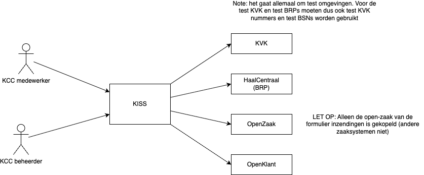
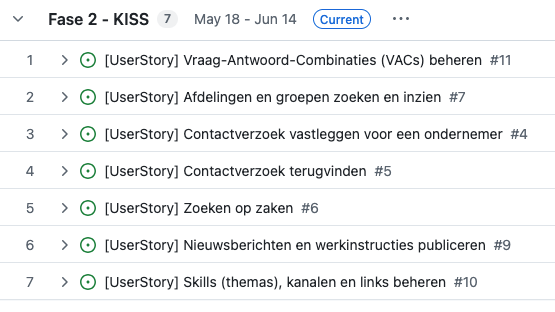
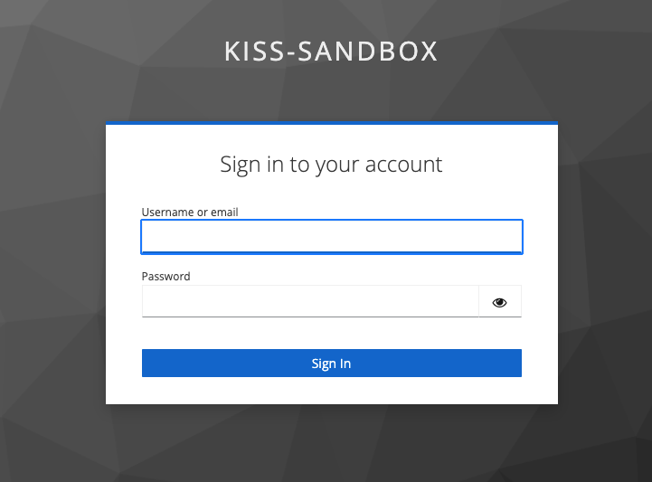

# KISS - Fase 1
Dit document bevat wat naslag werk om mee aan de slag te gaan voor het testen.


## Wat is er klaar om te testen?

### Koppelingen en rollen



### Klaar voor testen


### Nog niet afgerond:
- Inloggen met entra ID
- Zoeken op medewerkers of terugbelverzoeken koppelen aan medewerkers
- Vraag en Andwoord Combinaties (VACs) bijwerken - Er zit een bug in een ander software component.

## Waar
De KISS omgeving is hier te vinden: https://kiss.kcc-dev.csp-nijmegen.nl/


## Inloggen
De koppeling met onze nijmegen login is nog niet gemaakt. 
Testgebruikers krijgen nu handmatig een account waarmee zij kunnen inloggen.

Je kan dan met gebruikersnaam inloggen op dit scherm (wordt automatisch geladen als je naar KISS gaat.)



### Als medewerker
Gebruikernsaam: kcc-medewerker
Wachtwoord: test123

### Als beheerder
Gebruikersnaam: kcc-beheerder
Wachtwoord: test123

# Test data

## Test inwonwer

Er zijn een aantal nijmeegse test BSNs, ik heb ook een ander test BSN toegevoegd dat veel data heeft (zaken etc.).


### BSN 999971773
```
Naam (aanschrijfwijze) 	D. Çağla
Initialen 	D.
Voornamen 	Demir
Voorvoegsel 	
Geslachtsnaam 	Çağla
Geboortedatum 	1 januari 1956
Nederlandse nationaliteit 	Ja
Geslachtsaanduiding 	M
Adresgegevens: Mariënburg 30, 6511 PS NIJMEGEN
```

### BSN 999971785
```
Naam (aanschrijfwijze) 	S. van 't Hul
Initialen 	S.
Voornamen 	Sem
Voorvoegsel 	van 't
Geslachtsnaam 	Hul
Geboortedatum 	1 januari 2006
Nederlandse nationaliteit 	Ja
Geslachtsaanduiding 	M
Adresgegevens
Mariënburg 30
6511 PS NIJMEGEN
```

### BSN 999971797
```
Naam (aanschrijfwijze) 	P. Hendriks
Initialen 	P.
Voornamen 	Peter
Voorvoegsel 	
Geslachtsnaam 	Hendriks
Geboortedatum 	10 oktober 1985
Nederlandse nationaliteit 	Ja
Geslachtsaanduiding 	M
Adresgegevens
Korte Nieuwstraat 6
6511 PP NIJMEGEN
```
### BSN 999971803
```
Naam (aanschrijfwijze) 	E. van de Kamp
Initialen 	E.
Voornamen 	Eva
Voorvoegsel 	van de
Geslachtsnaam 	Kamp
Geboortedatum 	1 mei 1995
Nederlandse nationaliteit 	Ja
Geslachtsaanduiding 	V
Adresgegevens
Korte Nieuwstraat 6
6511 PP NIJMEGEN
```
### BSN 999971815
```
Naam (aanschrijfwijze) 	S. Hendriks van de Kamp
Initialen 	S.
Voornamen 	Stijn
Voorvoegsel 	
Geslachtsnaam 	Hendriks van de Kamp
Geboortedatum 	1 januari 2022
Nederlandse nationaliteit 	Ja
Geslachtsaanduiding 	M
Adresgegevens
Korte Nieuwstraat 6
6511 PP NIJMEGEN
```

### BSN 999999333

> deze heeft veel test gegevens in onze gekoppelde omgevingen
```
Naam (aanschrijfwijze) 	N. Boeddhoe
Initialen 	N.
Voornamen 	Nasier
Voorvoegsel 	
Geslachtsnaam 	Boeddhoe
Geboortedatum 	19 september 1950
Nederlandse nationaliteit 	Nee
Geslachtsaanduiding 	M
Adresgegevens
Anna van Saksenlaan 71
2593 HW 'S-GRAVENHAGE
```

## Test bedrijven
- 69599084 - Eenmanszaak - Test EMZ Dagobert
- 90004973 - Foutmelding - (triggert een foutmelding)
- 68727720 - NV - Test NV Katrien
- 90004760 - NV - Local Funzoom N.V.
- 68750110 - BV - Test BV Donald
- 90001354 - BV - Grand Kontex B.V.
- 69599068 - Stichting - Test Stichting Bolderbast
- 90000102 - Stichting - Stichting Free opentrans
- 90006623 - Stichting - Stichting Uc027Tc01Tg01 1652253635399
- 69599076 - VoF - Test VOF Guus

